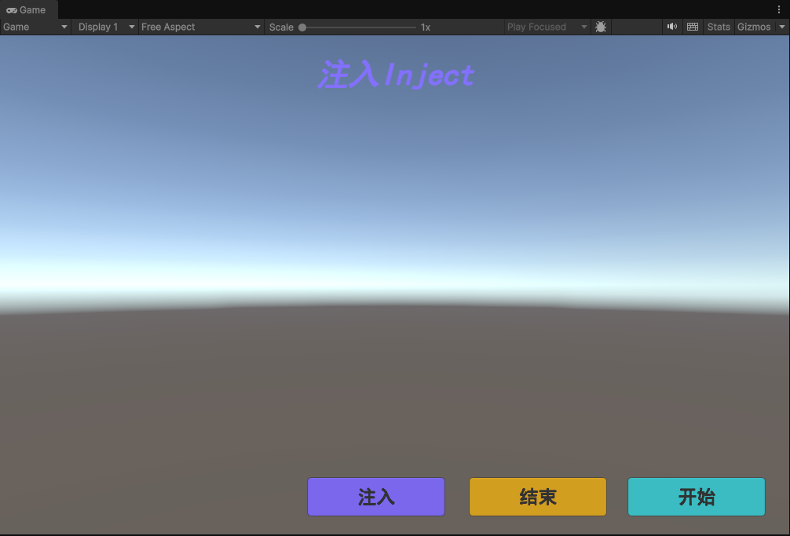
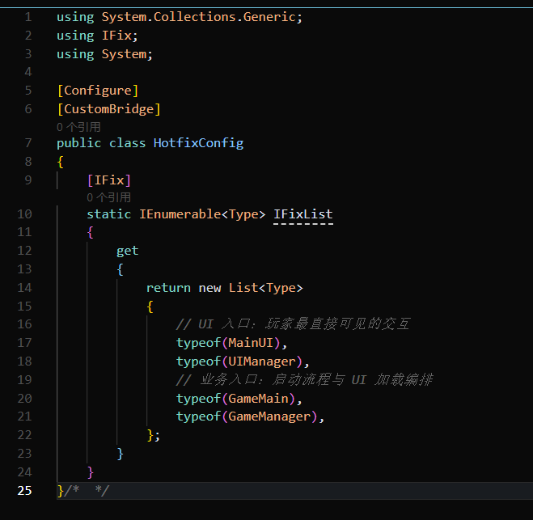
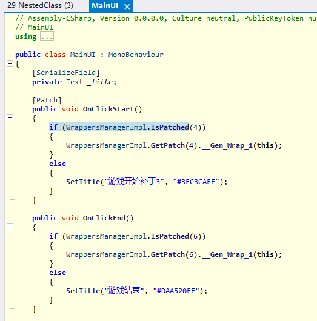
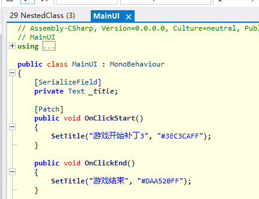
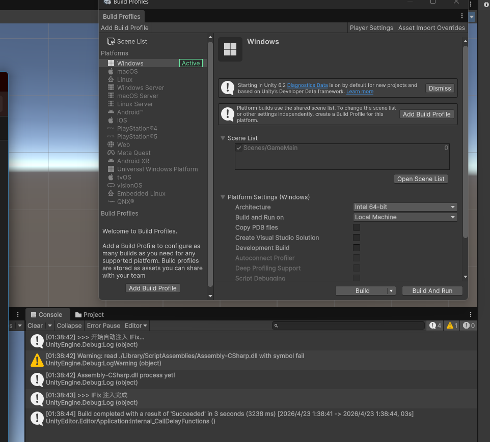
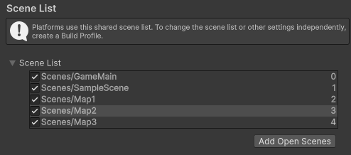
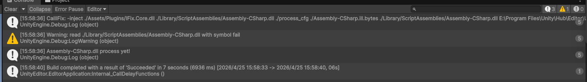
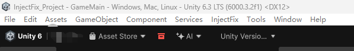
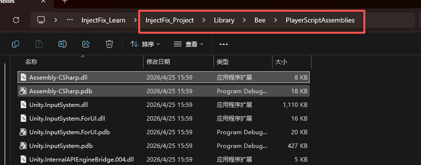
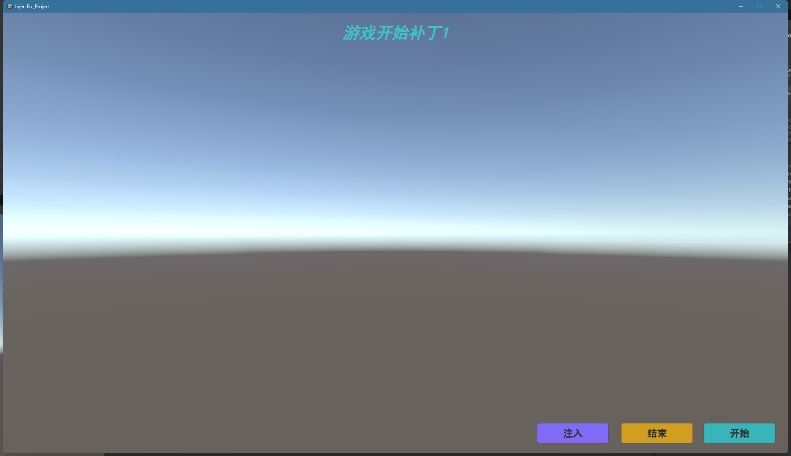

# 为什么打包的程序集里面没有注入

## 问题描述

在出包之后尝试动态加载 .patch.bytes 来进行热重载，但是加载的时候报错提醒没有注入过，报错如下

``` log
调用 IFix.Core.PatchManager 失败: Exception: assembly may be not injected yet, cat find IFix.ILFixInterfaceBridge, Assembly-CSharp, Version=0.0.0.0, Culture=neutral, PublicKeyToken=null
  at IFix.Core.PatchManager.Load (System.IO.Stream stream, System.Boolean checkNew) [0x000b9] in <60aad8293bc144689d197ce18f5dd0ad>:0 
  at IFix.Core.PatchManager.Load (System.String filepath) [0x00008] in <60aad8293bc144689d197ce18f5dd0ad>:0 
  at HotfixPatchLoader.TryLoadPatch (System.String patchPath) [0x00010] in <3f39adffd22f4635a31b125d4910aa36>:0 
```

所以需要查证问题

## 现状

1. 编辑器是没有问题的，出包会有问题
2. 本来想模拟更新逻辑，放到 persistentDataPath 文件夹，不过在工程内部方便起见 StreamingAssets 文件夹下面，也没想太多，反正都是测试，当作资源下载就行，我会手动替换添加到这个文件夹将patch

## 验证

> 下面是记录了我查证问题的思路，像验证五就是错误写法，由于没有正确理解打包思路

### 猜想一：patch路径问题

猜想：虽然是在 StreamingAssets 文件夹，但是不是可能出包之后路径变了

测试：打印日志后，按照文件夹目录查找是没问题的，严格按照 StreamingAssets 目录去

```
准备加载补丁，patchPath: .../InjectFix_Learn/InjectFix_Project/Build/InjectFix_Project_Data/StreamingAssets\Assembly-CSharp.patch.bytes
```

结论：路径没有问题，同时也验证了直接拖进打包后的 StreamingAssets 文件夹是可以测试的

### 验证二 是否加载时机问题

猜想：是不是时机问题，我是不是不应该一开始就加载，而是自己先手动点击加载测试下

测试：删掉了GameMain里面的自动加载逻辑，在主界面加了一个主动调用加载的按钮，出包之后发现还是没用，与时机没关系，本来就是一厢情愿的一个测试



结论：与一开始触发没有关系

### 验证三 打的标签不够多

猜想：是不是基础出包版本，至少需要一个[Patch]标签或者更多量大管饱的配置才能将注入代码给打进去

测试：加了两三个标签，甚至将[Configure]和[IFix]的代码对象多加几个才行，量大管饱？甚至还尝试了[CustomBridge]标签，最终表明还是没用



结论：跟多打少打标签没关系，最基础的配置是没问题的

### 验证四 测试反编译

猜想：既然打包就是不行，没有思路，去反编译看下编辑器的dll和打包的dll有什么区别

测试：不看不知道，一看吓一跳，答案里面呼之欲出，就是注入没生效

- 编辑器注入后的DLL：
 
- 出包后的DLL：
 

> 这里直接进入总结，不需要分析了，因为看完这两张图之后立马理解了所有

---
总结理解：看完这两张图，让我**作为小白**立马理解了它的热更原理
 1. **InjectFix热更的原理**：之前只是看了网上的文章，但没有深入理解注入的含义。看了编译代码后就知道，本质上是将标记的类里面的方法都添加了补丁 `if (WrappersManagerImpl.IsPatched(5))`，所以这也是DLL都变大的原因之一
 2. **Inject范围**：不是只有提前打了[patch]标签的方法才能被注入使用热更新，而是只要在[Configure]的[IFix]对象里面配置的类的所有方法都会被注入
 3. **[Patch]标签**：[Patch]标签是在修复阶段使用的，是为了使用`Inject/Fix`生成patch的时候知道哪些代码需要修复，是不需要提前预埋的
 4. **Inject需要重新点**：每次触发编译注入状态就会丢失，都需要重新点菜单`Inject/Fix`。原因就是重新触发编译注入代码就会丢失，因为注入的代码是在原有代码基础上进行的二次代码注入修改，并不是原有的代码直接编译生成的
---

### 验证五 监听构建流程

虽然上面总结了，但是还没有最终修复

最终原因其实是这个：**构建时未自动触发注入**

> InjectFix 的注入机制与 Unity 的构建管线（Build Pipeline）存在冲突。
> 
> 简单来说，你在编辑器里看到的“注入”是针对 Library/ScriptAssemblies/Assembly-CSharp.dll 修改的。但是当你点击 Build 时，Unity 往往会重新编译一份全新的程序集，或者在 IL2CPP 转换阶段把之前的修改给“覆盖”或“忽略”了。

所以最终需要编写一个脚本，确保在 Unity 打包之前，强制调用 InjectFix 的注入逻辑。

```
using UnityEngine;
using UnityEditor;
using UnityEditor.Build;
using UnityEditor.Build.Reporting;
// 引用 IFix 命名空间
using IFix; 
using IFix.Editor;

public class IFixPreBuild : IPreprocessBuildWithReport
{
    // 设置回调顺序，确保在打包前执行
    public int callbackOrder { get { return 0; } }

    public void OnPreprocessBuild(BuildReport report)
    {
        Debug.Log(">>> 开始自动注入 IFix...");
        // 调用 InjectFix 的核心注入方法
        // 注意：不同版本 IFix 入口可能略有不同，通常是 Injector.Inject() 或类似菜单对应的函数
        try 
        {
            // 这里通常需要调用类似于 Editor 菜单 "InjectFix/Inject" 对应的底层代码
            // 参考 IFix 源码中的 Injection.cs 或类似文件
            IFixEditor.InjectAssemblys();
            Debug.Log(">>> IFix 注入完成");
        }
        catch (System.Exception e)
        {
            Debug.LogError(">>> IFix 注入失败: " + e);
        }
    }
}
```

https://docs.unity3d.com/6000.3/Documentation/ScriptReference/Build.IPostprocessBuildWithReport.html
在玩家构建过程完成后，立即实现该接口执行代码。

添加脚本编译后处理注入的构建日志
 

> 警告，这里还有问题，还是没生效需要想一下

### 验证六 查看iFixEditor代码

验证五最终还是失败了，最终还是删掉了这个代码

我尝试去看代码寻找答案，最终我看到了这份代码

``` csharp
public static bool AutoInject = true; //可以在外部禁用掉自动注入

public static bool InjectOnce = false; //AutoInjectAssemblys只调用一次，可以防止自动化打包时，很多场景导致AutoInjectAssemblys被多次调用

static bool injected = false;

[UnityEditor.Callbacks.PostProcessScene]
public static void AutoInjectAssemblys()
{
    if (AutoInject && !injected)
    {
        InjectAllAssemblys();
        if (InjectOnce)
        {
            injected = true;
        }
    }
}
```

那这个不就是自动触发构建的代码吗，因为打包过程中需要遍历场景，所以这个方法不就可以触发了吗？

> InjectOnce 是 用来保护构件中重复触发注入的，自行处理

是否跟没有场景数量有关？



我添加了四个场景后，触发构建



> 此时我再次触发构建，发现注入日志又没了，为什么没触发？

 其实看到这里有经验的一定能想到，缓存原因，构建过了就不会再触发了，必须出现相关的资源变动才能再次触发遍历场景

结果：验证之后，还是没有注入

### 验证七 路径问题

看了验证六里面的日志后会想，为什么传入的文件夹是Library，这个跟构建后的DLL路径 `Build\InjectFix_Project_Data\Managed` 有什么关系

因为AutoInjectAssemblys方法触发了，想解决问题继续往下看唯一调用的方法，InjectAllAssemblys

``` csharp
/// <summary>
/// 对injectAssemblys里的程序集进行注入，然后备份
/// </summary>
public static void InjectAllAssemblys()
{
    if (EditorApplication.isCompiling || Application.isPlaying)
    {
        return;
    }

    targetAssembliesFolder = GetScriptAssembliesFolder();

    foreach (var assembly in injectAssemblys)
    {
        InjectAssembly(assembly);
    }
    
    //doBackup(DateTime.Now.ToString(TIMESTAMP_FORMAT));

    AssetDatabase.Refresh();
}
```

如代码所示，会获取脚本DLL路径，这里看起来是唯一跟打包DLL有关系的地方

``` csharp
private static string GetScriptAssembliesFolder()
{
    var assembliesFolder = "PlayerScriptAssemblies"; // 这个路径是什么？
    if (!Directory.Exists(string.Format("./Library/{0}/", assembliesFolder)))
    {
        assembliesFolder = "ScriptAssemblies";
    }
    return assembliesFolder;
}

```

下面的 ScriptAssemblies 文件夹我知道，都是Editor使用的DLL，毕竟我编辑器验证日志都跟我说这个路径，而且也确实注入了。

但是这个 PlayerScriptAssemblies 文件夹是什么？起初我根本没在意这个文件夹，但现在没有办法，连这个也开始换衣了，所以这里抱着好奇去查了下

---

> PlayerScriptAssemblies is a temporary folder in a Unity project's Library directory that contains compiled Managed Assemblies specific to a player build.

PlayerScriptAssemblies 是 Unity 项目 Library 目录中的一个临时文件夹，包含特定于播放器构建的已编译托管程序集。

**作者曰：Library/PlayerScriptAssemblies 是缓存已编译的程序集的临时文件夹，这就是我想要的DLL注入路径**

---

所以 那为什么日志 最后显示的还是 Library/ScriptAssemblies

反复打包几次后发现 我根本见过 PlayerScriptAssemblies 文件夹啊，那这又不对了=。=

网上查询可能是6000版本的问题，正巧我此时我用的6000.3版本的Unity进行验证~~



那我就只能在Library下面找这个文件夹了，又开始找找



终于，在 Library\Bee 下找到了 PlayerScriptAssemblies 文件夹

**作者曰：终于！！！！！所以打包没有注入的原因终于找到了，由于Unity6000版本的问题，文件夹路径错了~~~~**

虽然是由于版本更新导致的这件事，不过也侧面了解了打包过程中DLL缓存路径这件事，看来打包还需要深入了解规则才行

修改后的代码

``` csharp
private static string GetScriptAssembliesFolder()
{
    var assembliesFolder = "Bee/PlayerScriptAssemblies"; // 修改文件夹路径
    if (!Directory.Exists(string.Format("./Library/{0}/", assembliesFolder)))
    {
        assembliesFolder = "ScriptAssemblies";
    }
    return assembliesFolder;
}
```

结果：替换掉iFixEditor里面的文件夹路径后成功了

``` log
Inject 自检通过：已找到 IFix.ILFixInterfaceBridge。
准备加载补丁，patchPath: xxx/InjectFix_Learn/InjectFix_Project/Build/InjectFix_Project_Data/StreamingAssets\Assembly-CSharp.patch.bytes
```

> 备注：默认没有修改的构建，执行构建后的exe的日志路径在C盘：
> C:\Users\xxx\AppData\LocalLow\DefaultCompany\InjectFix_Project\Player.log

此时再将Fix后的bytes手动加到 streamingAssets文件夹下



**作者曰：注意，打包之后需要手动删掉 Bee/PlayerScriptAssemblies 文件夹，否则执行Fix的时候会有限找到这个文件夹做检测，导致生成Fix失败**

### 总结

所以，没有打包没有注入的原因

1. 在Unity6000版本上打包时，iFixEditor注入的文件夹路径错了，应该是 Library\Bee\PlayerScriptAssemblies，而不是 Library\PlayerScriptAssemblies 

2. 至少需要触发一次场景遍历才行，否则注入逻辑不会主动执行