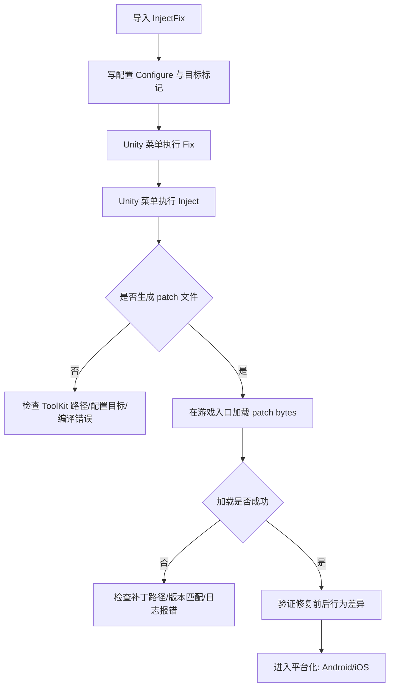

# InjectFix 总结

## 先理解菜单按钮（你在点什么）

### `InjectFix/Inject`
- 作用：对程序集做“预处理注入”，让目标程序集具备后续打补丁的基础。
- 直观理解：先把房子打好管线，后面补丁才能接进去。
- 常见时机：代码变更后、生成补丁前执行一次。

### `InjectFix/Fix`
- 作用：根据你的配置和标记，生成补丁文件（通常是 `.patch.bytes`）。
- 直观理解：真正“产出热修包”。
- 注意：只生成文件，不会自动生效；要在运行时加载补丁。

### `InjectFix/Fix(Android)` / `InjectFix/Fix(IOS)`
- 作用：按平台模板生成对应平台补丁。
- 建议：初学先用普通 `Fix` 跑通流程，再做平台化。

---

## 常见特性（Attribute）是什么意思

### `[Patch]`
- 标记“修复逻辑”相关方法，表示希望通过补丁替换原有行为。

### `[Interpret]`
- 标记需要解释执行的成员/类型（可热更新逻辑的一种方式）。

### `[IFix]`
- 常用于配置层，声明哪些类型参与 InjectFix 处理。

### `[Configure]`
- 配置类入口，集中告诉工具“哪些类型/方法要处理”。
- 没有正确配置时，`Fix` 可能执行但不会产出有效补丁。

---

## 一句话记住完整闭环

`标记目标 -> Fix（先出补丁） -> Inject（再注入） -> 运行时加载补丁 -> 行为变化验证`

---

## 流程图（学习版）

---

## 发布策略速记（你最关心）

### 每次出主包都要注入吗
- 基本是要的。主包变了（程序集变了），通常要重新 `Inject` 一次。
- 可以把 `Inject` 理解为“给这个主包版本安装热修接入层”。

### 补丁是不是热更补丁
- 是。`Fix` 产出的 `.patch.bytes` 就是热更补丁文件。
- 它依赖特定主包版本，不建议跨版本混用。

### 推荐执行顺序（稳定版）
1. 主包代码确定后先执行 `Fix`（产出补丁）。
2. 再执行 `Inject`（注入当前主包程序集）。
3. 打包并在运行时加载补丁验证。

### 版本管理建议
- 给补丁加版本号（或与主包版本绑定）。
- 主包升级后，旧补丁按“可能失效”处理，重新生成并验证。

