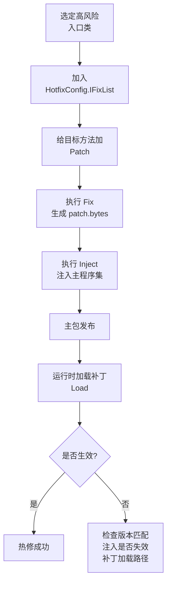
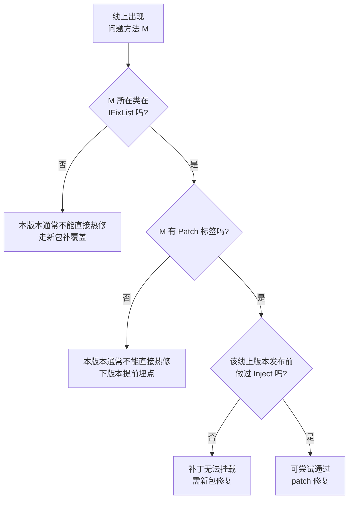

# InjectFix 热修总结与流程图

## 一句话结论

在本项目中，某方法想要被线上补丁修复，必须同时满足：

- 所在类被纳入 `IFixList`；
- 目标方法标记 `[Patch]`；
- 发布该版本前已执行 `Inject` 并随主包上线；
- 运行时成功 `Load` 对应版本补丁。

可记为：

`IFixList（范围） + [Patch]（入口） + Inject（注入） + Load（加载） = 热修生效`

---

## 核心概念

- `IFixList`：定义“哪些类允许参与热修处理”。
- `[Patch]`：定义“哪些方法是可替换入口”。
- `Fix`：生成 `.patch.bytes` 补丁产物。
- `Inject`：把热修桥接能力写入主程序集（发布前动作）。
- `Load`：运行时加载补丁使修复生效。

---

## 生效流程图

---

## 是否可热修判断图（3 步）

---

## 当前项目落地状态

`HotfixConfig.IFixList` 已纳入以下入口类（最小覆盖策略）：

- `MainUI`
- `UIManager`
- `GameMain`
- `GameManager`
- `HotfixPatchLoader`

目的：优先保证“用户可感知、业务关键、补丁加载链路”可修，而不是全量铺开。

---

## 固定执行顺序（避免失效）

1. Unity 无编译错误；
2. 执行 `InjectFix/Fix`；
3. 拷贝 `Assembly-CSharp.patch.bytes` 到 `StreamingAssets`；
4. 执行 `InjectFix/Inject`；
5. 立即运行验证（避免再次重编译覆盖注入结果）。

---

## 常见误区

- 只加了 `IFixList`，但目标方法没 `[Patch]`。
- 有 `[Patch]`，但类未纳入 `IFixList`。
- 顺序写反：先 `Inject` 后 `Fix`。
- `Inject` 后又触发脚本重编译，导致注入失效。
- 旧补丁配新主包（或反过来），版本不匹配。

---

## 维护建议（长期）

- 每次迭代只增补真实高风险入口（1~3 个），避免过度配置。
- 工具层、稳定层默认不纳入，出现真实线上风险再补。
- 将每次线上问题复盘写入覆盖清单，形成项目自己的“热修白名单”。
